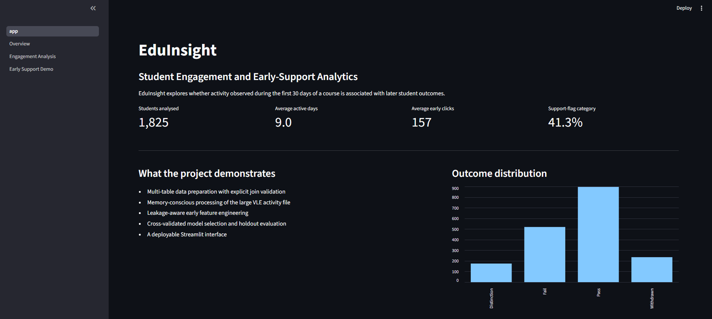
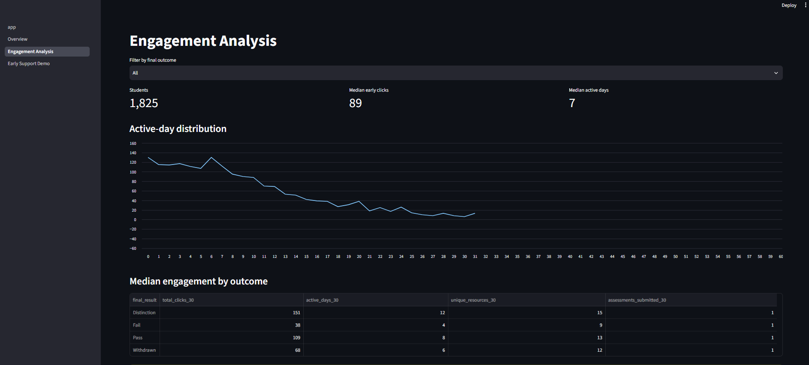
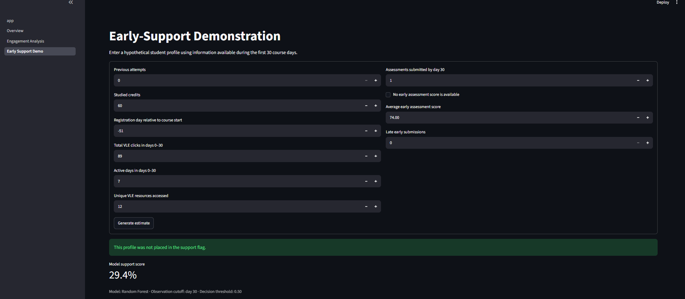

# EduInsight: Student Engagement and Early-Support Analytics

EduInsight is an end-to-end data science portfolio project that explores how
student activity observed during the first 30 days of a course relates to later
academic outcomes. It combines reproducible data preparation, exploratory
analysis, machine learning, testing, and a Streamlit dashboard.

**Release status:** Version 1.0.0 release candidate.

## Why this project

The project is designed to demonstrate more than a single notebook. It shows:

- multi-table data preparation and validated joins;
- chunked processing of a large activity file;
- leakage-aware feature engineering;
- a clean separation between notebooks and reusable Python modules;
- cross-validated model selection with a final holdout evaluation;
- automated tests and defensive error handling;
- a deployable Streamlit interface.

## Research question

**Can activity available during the first 30 course days help identify student
profiles that may benefit from additional academic support?**

The output is a portfolio demonstration, not an automated academic decision.

## Model results

Two candidate classifiers were compared using stratified cross-validation on
the training partition. The selected model was then evaluated once on an
untouched holdout set.

| Metric | Holdout result |
|---|---:|
| Balanced accuracy | `0.666` |
| Precision — support flag | `0.661` |
| Recall — support flag | `0.603` |
| F1-score — support flag | `0.607` |
| ROC-AUC | `0.74` |
| Average precision | `0.678` |

### Confusion matrix

| | Predicted no flag | Predicted support flag |
|---|---:|---:|
| Actual no flag | `156` | `58` |
| Actual support flag | `60` | `91` |

The model output is an early-support demonstration. It is not a diagnosis,
grade, or replacement for educator judgment.

## Application preview

### Project overview



### Engagement analysis



### Early-support demonstration



## Repository structure

```text
eduinsight-student-success/
├── app.py
├── README.md
├── requirements.txt
├── data/
│   ├── README.md
│   ├── raw/
│   └── processed/
├── notebooks/
│   ├── 01_data_understanding.ipynb
│   ├── 02_data_preparation.ipynb
│   ├── 03_exploratory_analysis.ipynb
│   └── 04_model_development.ipynb
├── src/
│   ├── __init__.py
│   ├── data_preparation.py
│   ├── feature_engineering.py
│   └── model_training.py
├── pages/
│   ├── 1_Overview.py
│   ├── 2_Engagement_Analysis.py
│   └── 3_Early_Support_Demo.py
├── models/
├── images/
└── tests/

